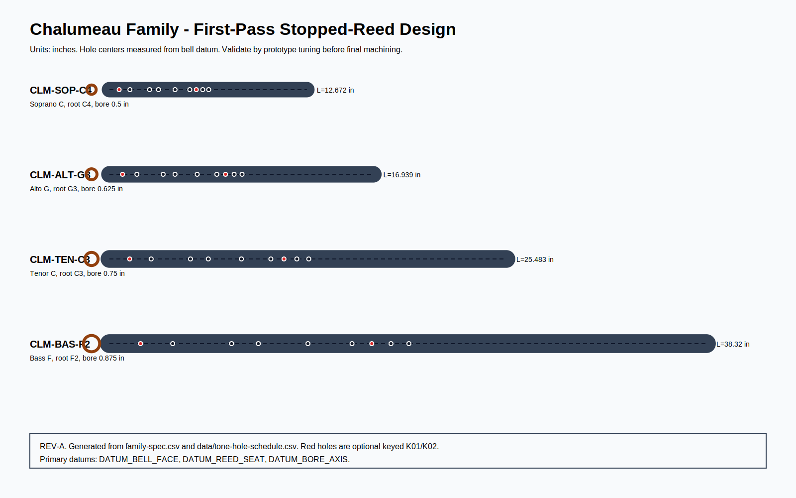
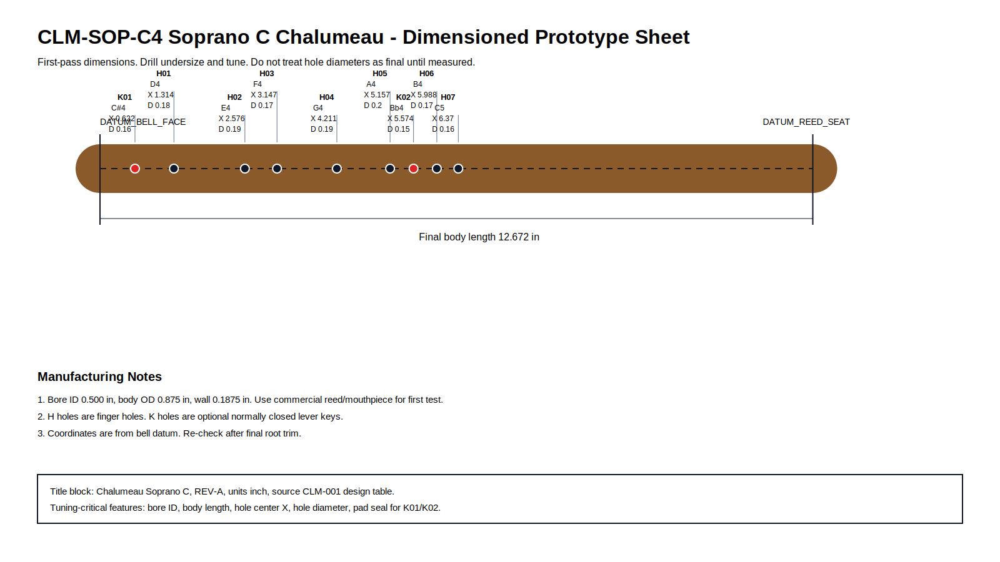
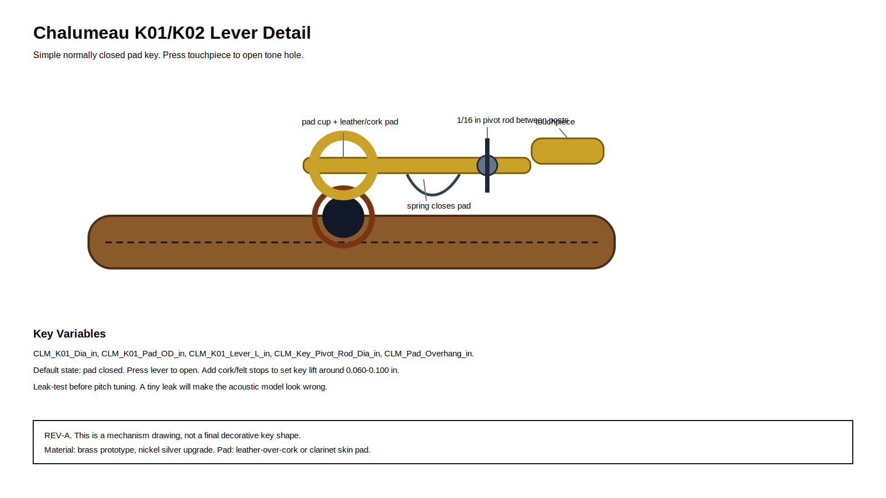
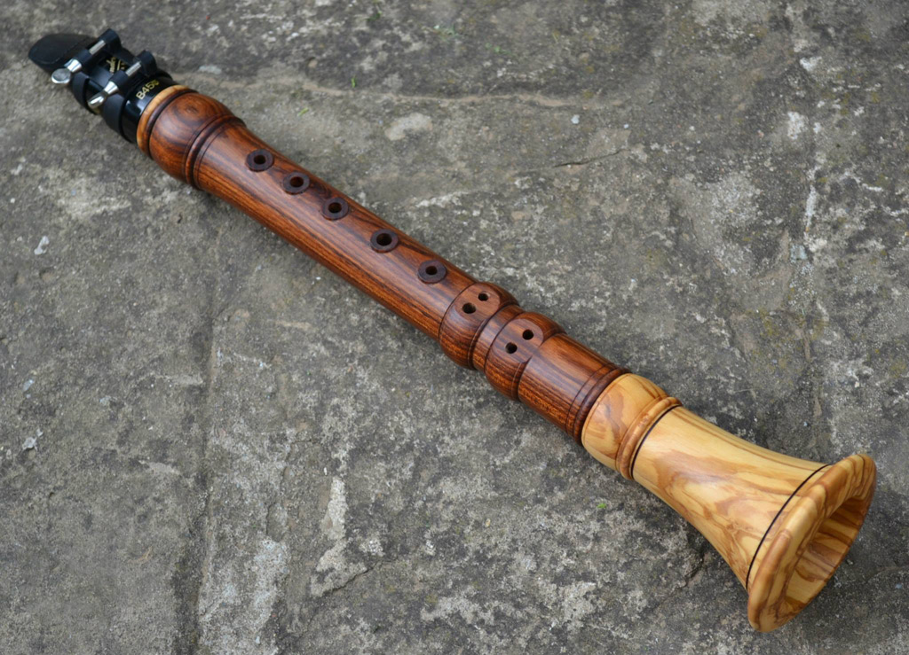
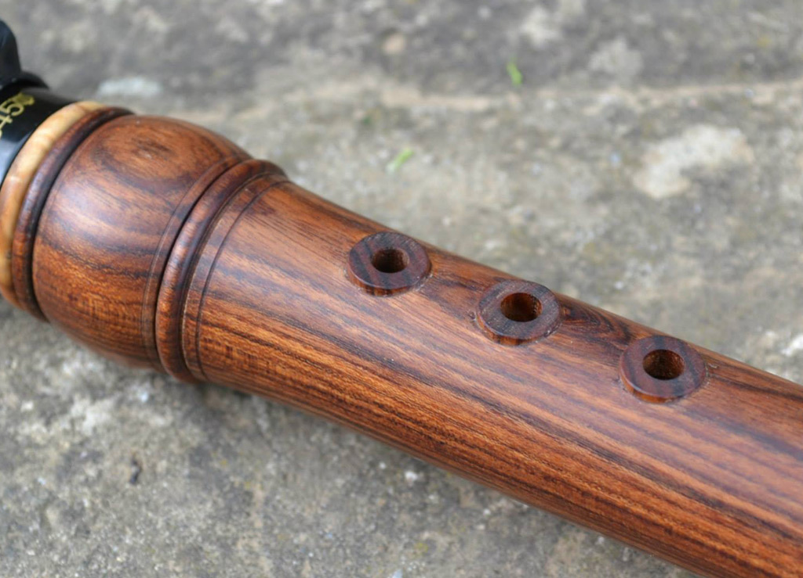

# Chalumeau Family Capstone
- Musical instrument documentation capstone
- Build packet: chalumeau
- Generated: 2026-05-03

---

# Project Intent
- Design a family of chalumeaux that can be built in Tony's shop using
lathe/CNC workflows, commercial reeds for early isolation tests, and
optional handmade metal keywork. The family should cover a useful range
without pretending the first-pass physics is final: all tone-hole
coordinates are starting points that must be validated with a real reed,
mouthpiece, bore, and player pressure.

_Speaker notes:_ Read design.md before committing to dimensions or sourcing decisions.

---

# Physics Model
- The chalumeau is modeled as a cylindrical single-reed pipe that behaves
like a stopped pipe in its low register.

```
f = c / (4 * L_eff)
L_eff = c / (4 * f)
c = 13552 in/s at about 68 F
body_length = L_eff - bell_end_correction - reed_end_correction
bell_end_correction = 0.61 * bore_radius
reed_end_correction = 0.25 * bore_id   # first-pass assumption
tone_hole_x_from_bell = body_length - (c/(4*f_note) - reed_corr - 0.30*hole_dia)
cents_error = 1200 * log2(measured_hz / target_hz)
```

_Speaker notes:_ Governing equations extracted verbatim from design.md. Apply empirical corrections (NAF K2, scale offsets) only where the model permits — see references/acoustic-models.md.

---

# Hardware Alignment
- The hardware is intentionally small-shop manufacturable:

| Hardware | Role | First-build method | Upgrade path |
| --- | --- | --- | --- |
| K01 lever | opens low semitone tone hole | brass strip lever, pivot post pair, leather/cork pad | nickel-silver lever with soldered pad cup |
| K02 lever | opens upper chromatic tone hole | side lever with flat spring return | clarinet-style post/rod key with regulation cork |
| Optional register vent | tests clarinet evolution | leave undrilled until the body speaks well | small lined vent tube near mouthpiece |
| Raised tone-hole collars | ergonomic/aesthetic reference to photos | turn integral collars or add rings | separate stabilized-wood collars |

_Speaker notes:_ Identifies which shop pipeline(s) this instrument lives in: Bambu+kiln slip-cast, 40W laser flat-pack, CNC+lathe, segmented turning, drum-skin work, or hybrid combinations.

---

# How To Use This Packet
- Start with design.md for intent and assumptions.
- Use bom.csv, sourcing.csv, and cut-list.csv before buying or cutting.
- Use drawing-brief.md and CAD/CNC folders before machining.
- Print the packet for shopping, shop work, and validation.

---

# File Map
- design.md: Project intent, catalog metadata, assumptions, and validation plan.
- bom.csv: Starter bill of materials with part categories, quantities, drawing refs, and notes.
- sourcing.csv: Supplier/search tracker with specs, price/date fields, lead time, substitutes, and risks.
- cut-list.csv: Rough/final stock sizes, material, grain/orientation, operations, yield, and offcuts.
- drawing-brief.md: Manufacturing drawing and technical product sketch brief.
- assembly-manual.md: Shop-facing sequence, tools, fixtures, safety, tuning, finishing, and maintenance notes.
- validation.csv: Target/measured values, tolerance, environment, result, and tuning/build action log.
- supplier-rfq.md: Supplier email/request-for-quote starter.

---

# Family Spec

| instrument_id | variant | root_note | root_midi | root_frequency_hz | bore_id_in | wall_thickness_in | body_od_in | bell_od_in | acoustic_length_in | body_length_final_in | blank_length_in | turning_blank_in | sections | build_priority | status |
| --- | --- | --- | --- | --- | --- | --- | --- | --- | --- | --- | --- | --- | --- | --- | --- |
| CLM-SOP-C4 | Soprano C | C4 | 60 | 261.63 | 0.5 | 0.188 | 0.875 | 1.65 | 12.95 | 12.672 | 14.172 | 1.25 x 1.25 x 14.172 | 1 body + mouthpiece + bell | Prototype 1 | first-order design; validate after reed and bore prototype |
| CLM-ALT-G3 | Alto G | G3 | 55 | 196.0 | 0.625 | 0.219 | 1.063 | 1.95 | 17.286 | 16.939 | 18.439 | 1.438 x 1.438 x 18.439 | 1 body + mouthpiece + bell | Prototype 2 | first-order design; validate after reed and bore prototype |
| CLM-TEN-C3 | Tenor C | C3 | 48 | 130.81 | 0.75 | 0.25 | 1.25 | 2.35 | 25.9 | 25.483 | 26.983 | 1.625 x 1.625 x 26.983 | 2 body joints + mouthpiece + bell | Prototype 3 | first-order design; validate after reed and bore prototype |
| CLM-BAS-F2 | Bass F | F2 | 41 | 87.31 | 0.875 | 0.313 | 1.5 | 2.9 | 38.806 | 38.32 | 39.82 | 1.875 x 1.875 x 39.82 | 3 body joints + mouthpiece + bell | Stretch prototype | first-order design; validate after reed and bore prototype |

_Speaker notes:_ Sizes scale via the master scale factor; tuning targets are first-order Helmholtz/cantilever predictions to be empirically corrected per prototype.

---

# Build Workflow
- Design and assumptions
- Source materials and hardware
- Prepare stock, fixtures, and CNC/laser/lathe setup
- Assemble, tune, finish, and validate

---

# Sourcing And BOM
- BOM gives part categories and drawing references.
- Sourcing tracks search terms, supplier candidates, price/date, lead time, substitutions.
- Visual BOM brief turns the parts list into a presentation-ready image board.

---

# Shop Packet
- Cut list for lumber/sheet/blank planning.
- Assembly manual for away-from-keyboard work.
- Validation sheet for measured dimensions, tuning, pass/fail checks.

---

# Drawings, CAD, CNC
- drawing-brief.md defines required views, dimensions, datums, sketch intent.
- cad/ holds models and design tables.
- cnc/ holds CAM, toolpaths, setup sheets, dry-run notes.
- drawings/ holds PDFs, SVGs, DXFs, drawing exports.





---

# Images And Screenshots
- images/chalumeau1.jpg
- images/chalumeau5.jpg




---

# Validation Plan
- A4 = 440 Hz reference check.
- Tuning targets logged in validation.csv.
- Critical dimensions verified against design sheet and CAD.
- Photos and revision notes after each major step.

---

# Open Risks / Decisions
- TBDs in design sheet and BOM.
- Supplier price/availability not yet verified.
- Generated images marked as concept placeholders.
- Empirical corrections await measured prototype data.

---

# Next Actions
- Replace TBDs with measured/source-backed values.
- Verify live supplier price and availability before buying.
- Export final drawings and visual BOM images.
- Regenerate this deck and print packet after final edits.

---
